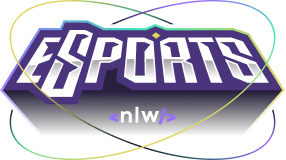

 
 
 

	

	<a href="#-technologies">Technologies</a>&nbsp;&nbsp;&nbsp;|&nbsp;&nbsp;&nbsp;
	<a href="#-about">About</a>&nbsp;&nbsp;&nbsp;|&nbsp;&nbsp;&nbsp;
	<a href="#-layout">Layout</a>&nbsp;&nbsp;&nbsp;|&nbsp;&nbsp;&nbsp;
	<a href="#-contributor">Contributor</a>

 

## 📕 About

The project is aimed at the eSports area.

It will be possible to create ads to connect people who play the same game. And for that, we will use the Twitch API to help us search for the most accessed games at the moment.

## 🚀 Technologies

This project was developed as the following technologies:

- [Node.js](https://nodejs.org/en/)
- [React](https://reactjs.org)
- [React Native](https://facebook.github.io/react-native/)
- [Expo](https://expo.io/)
- [TypeScript](https://www.typescriptlang.org/)

## ✨ Layout

In the link below you will find the layout of the web project and also the mobile one.

> Remembering that you need to have an account at [Figma](http://figma.com/) to access it.

- [Layout](https://www.figma.com/file/mDEbnoojksG4w8sOxmudh3/Happy-Web)

## 🤝 Contributor

You have some idea that could further leverage the project, and you want to implement it? It's simple!

1. Make project fork
2. Modify what you think is necessary
3. Commit the changes
4. Create a Pull Request

## 🔓 License

This project is under MIT license. [Click here](LICENSE.md) for more details.

---
